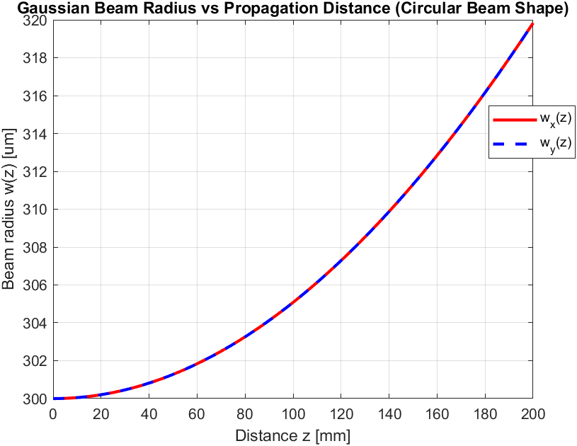

# Interferometer

## Overview
This is an open source interferometer build that will be integreated into the piezo stage build (inspired by the following paper: https://www.sciencedirect.com/science/article/pii/S2468067222000621)

